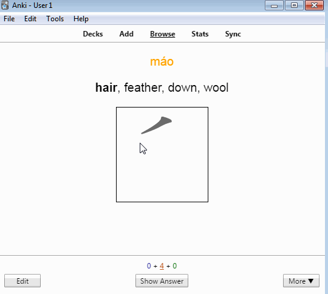
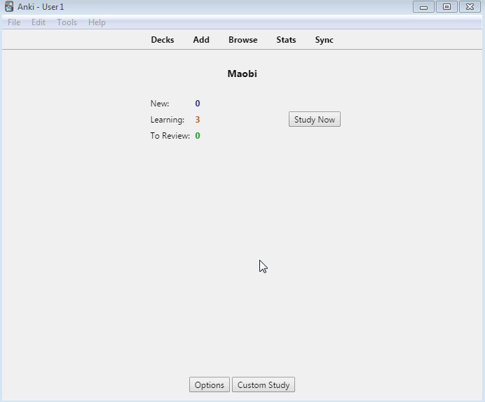

# anki-maobi

`máobĭ` (毛笔) is an Anki add-on to create cards with writing quizzes for Hanzi (Chinese characters). Have a look:

<p align="center">
  
</p>

## Motivation

Learning Chinese is difficult, remembering what you have learned even more so. I heavily rely on [Anki](https://apps.ankiweb.net/) to review my vocabulary. It has changed my study life and made it possible for me to remember all the words, characters, chengyu, sentences and pass my exams.

While Anki itself is good to remember the meaning of words and characters, I found it difficult to use for remembering writing Hanzi. There is the possiblity of using [AnkiDroid](https://github.com/ankidroid/Anki-Android) and the built-in whiteboard or defining a workflow as described in a [blog entry of EastAsiaStudent](https://eastasiastudent.net/study/skritter-functionality-for-free/). I tried it, but I did not like it too much.

A paid alternative that I used heavily in the past is [Skritter](https://skritter.com/). Right now, I really dislike the Version 2, their update policy and the bugs in the scheduling. It also is really unresponsive, making me wasting (lots of!) time by just waiting for the app. A contender of Skritter for mobile is [Inkstone](https://www.skishore.me/inkstone/), but I did not get warm with that either. 

Another aspect is that I personally do not like to use many different programs and tools to collect vocabulary. Therefore, I built *maobi* to remember writing Hanzi within *Anki*. Now, I have all my learning progress in one tool!

## Acknowledgement

I did not design the writing component, it comes from the awesome [Hanzi Writer](https://github.com/chanind/hanzi-writer) JavaScript library. Without it, this would not be possible. *maobi* merely bundles it with Anki. Please visit the *Hanzi Writer* website and look how nice it looks! 

The chinese character and stroke order data used by *Hanzi Writer* is derived from the [Make me a Hanzi](https://github.com/skishore/makemeahanzi). The data can be found in the [Hanzi Writer Data](https://github.com/chanind/hanzi-writer-data) repo.

## Configuration

In order to use *maobi*, you need to follow these simple steps:

### Download the add-on from the Anki homepage

Use the code found on the [maobi Anki page](https://ankiweb.net/shared/upload?id=931477147).

### Have a deck which contains character notes

You need to create a note type which has a field that contains the character, e.g. `Hanzi`. The other fields are up to you. You can e.g. use the card types that come with the extremely useful [Chinese Support Redux add-on](https://ankiweb.net/shared/info/1128979221).

Then, you need to create cards with this note type. I personally generated a deck with all important characters from [CC-CEDICT](https://cc-cedict.org/wiki/). After I imported it, I immediately suspended all cards. Whenever I want to learn a new character, I just search and then unsuspend it. This saves time from creating cards and looking up definitions.

### Create/alter a card type

In order to let *maobi* insert the quiz into a card, it needs to contain

    <div id="character-target-div"></div>

on the question side. In its position, the quiz will be inserted. You can style it with e.g. a border by adding 

    #character-target-div { 
        border-style: solid; 
        border-width: 1px; 
        display: inline-block
    }

to the CSS part in the card editor.

#### Example template

An example deck with example notes can be found in `data/Maobi.apkg` .

### Configure the decks and note types for which *maobi* is enabled

Before using *maobi*, it has to be specified for which decks and note types the add-on should be enabled. The field that contains the character to write also has to be specified.

In order to tell *maobi* these values, you need to edit the add-on configuration. For that, go to the Addons-Config via **Tools** → **Add-ons**. Select **maobi** and then click on **Config**.

The following GIF illustrates where to find the configuration:

<p align="center">
  
</p>

The configuration itself is written in JSON. The default configuration is

```
{
    "decks": [

    ],
    "note_types": [

    ],
    "field_name": "Hanzi"
}
```

The following paragraphs explain the values in detail.

#### Decks

This specifies for which decks *maobi* should be enabled. It expects a list of *full* deck name strings. The full name is the name you get when you try to rename a deck. For instance, in order to enable it for the decks `Chinese::Characters` and `Heisig Simplified Hanzi`, the config looks like

```
{
    "decks": [
        "Chinese::Characters",
        "Heisig Simplified Hanzi"
    ],
    ...
}
```

#### Note types

This specifies for which note types *maobi* should be enabled. It expects a list of note type name strings. For instance, in order to enable it for the note types `Writing` and `Character`, the config looks like

```
{
    "note_types": [
        "Writing",
        "Character"
    ],
    ...
}
```

#### Field name

The field name tells the add-on which field contains the character that should be quizzed. If for instance, the character is in the `Hanzi` field, then the config looks like

```
{
    ...,
    "field_name": "Hanzi"
}
```

## Disclaimer

This add-on right now just contains a basic implementation. It is by no means feature complete or well-tested. If you have feature requests or encounter bugs, please open an issue in the [issue tracker](https://github.com/Rentier/anki-maobi/issues).

## Development

I checkout this repository into my `git` folder, then symlink the `maobi` folder into `${AnkiData}\addons21`.

### Releasing

1. Bump the version number in `maobi\__version__.py`
2. Run `package.py`
3. Upload to `https://ankiweb.net/shared/upload`

## FAQ

### Did you create the widget which asks me to write characters?

I did not design the writing component, it comes from the awesome [Hanzi Writer](https://github.com/chanind/hanzi-writer) JavaScript library. Without it, this would not be possible. *maobi* merely bundles it with Anki. Please visit the *Hanzi Writer* website and look how nice it looks!

### Does this run offline?

Yes, it does. *maobi* is bundled with the character data from the [Hanzi Writer Data](https://github.com/chanind/hanzi-writer-data) repo. The Javascript from [Hanzi Writer](https://github.com/chanind/hanzi-writer) is also shipped with this addon.

### Why is this add-on so large?

In order to generate the quizzes and display characters, stroke information is needed. Although the character data for one Hanzi is relatively small, it adds up when you support over 9000 characters. I already compressed the data to reduce the footprint.

## License

**maobi** is released under an [MIT](https://raw.githubusercontent.com/rentier/anki-maobi/master/LICENSE.txt) license.

### Third-party

This add-on uses several third-party components. 

#### Hanzi Writer

Hanzi Writer is released under an [MIT](https://raw.githubusercontent.com/chanind/hanzi-writer/master/LICENSE) license.

#### Hanzi Writer data

The Hanzi Writer data comes from the [Make Me A Hanzi](https://github.com/skishore/makemeahanzi) project, which extracted the data from fonts by [Arphic Technology](http://www.arphic.com/), a Taiwanese font forge that released their work under a permissive license in 1999. You can redistribute and/or modify this data under the terms of the Arphic Public License as published by Arphic Technology Co., Ltd. A copy of this license can be found in [ARPHICPL.TXT](https://raw.githubusercontent.com/chanind/hanzi-writer-data/master/ARPHICPL.TXT).